# Tinyrooms Design
This documents described the design of tinyrooms, a multiplayer web-based game
where users can join and move across virtual rooms which are displayed as game
boards in a 3D view.

Users interact with the room, other users and NPCs primarily by using **cards**
which can be collected, bought and found throughout the game. Cards represent
anything from items in the game, actions, skills, emotes and more.

The core design principles of tinyrooms are:
- **Simplicity**: the base game mechanics and interactions should be easy to graps.
Most items on the UI should be interactive and do something, encouraging user exploration.
- **Modularity** this game is a sandbox. It is possible to add new worlds, card sets, NPC behaviors etc.
the entire game system should be designed to make it possible for AI agents to easily build
extensions to the game.
- **Learnability** the codebase should be easy to learn and follow. The codebase itself is a
teaching tool for a game design class.

-------------------------------------------------------------------------------
## UI
The Tinyrooms UI is implemented as a single-page web app. Its primary screen
displays a 3D room rendering in the center, users and NPCs on the left, and a
primary interaction area in the bottom. Overlay UIs can be displayed on top of 
the primary screen, either modal (like the inventory and room card screens 
described below) or non-modal (like the activity window)

> NOTE: In the screenshots below, red boxes with white test are labels/notes, they
> are NOT part of the UI.

### Main Screen
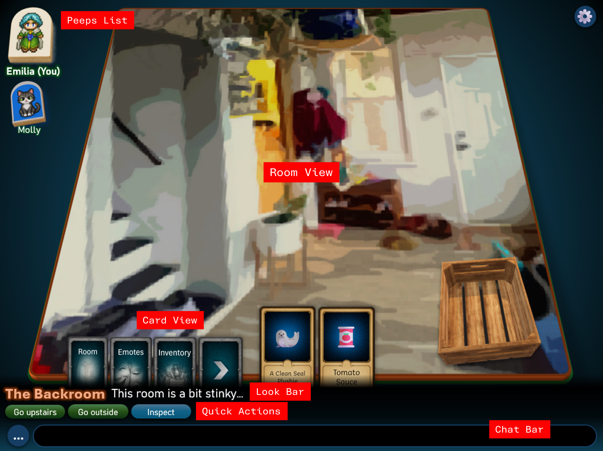

The Tinyrooms main screen has the folling main components (labeled with red 
boxes in the screenshot above):
- The Stage (center)
- The Peeps List (left)
- The Card View (bottom)
- The Look Bar (bottom, under card view)
- The Quick Actions Bar (bottom, under look bar)
- The Chat Bar (bottom, under quick action bar)

#### The Stage
The Stage is displayed in the middle of the game screen. A room is displayed as 
a floor that can be freely rotated / zoomed by the user. The floor may have 
3D objects and other features on it (Props). At minimum, rooms can have a different 
floor texture, but other more complex room displays are also supported.

#### The Peeps List
The Peeps List shows the list of peeps in this room (both users and NPCs).
The user's own peep is displayed at the top left, slightly larger than the others.

#### The Cards List
The Cards List shows a list of cards, which represent actions the user can take.
The card list is split into core cards and equipped cards.

**Core** cards are diplayed on the left, and represent core gameplay actions or 
submenus like checking the inventory or opening the list of available emotes. 
The list of visible core cards can depend on the room (eg the edit room card is 
visible if the user owns the room) and other gameplay features (ie core cards are
 enabled gradually in the tutorial world)

**Equipped** cards are cards in the player's hand, chosen from their deck (i.e.,
the inventory). Users can have a limited number of cards, which depends on their
level (starting limit: 5)

By default only the first three core cards are visible.
Clicking on the '>' Core card expands the core card list and stashes the equipped
cards to the right
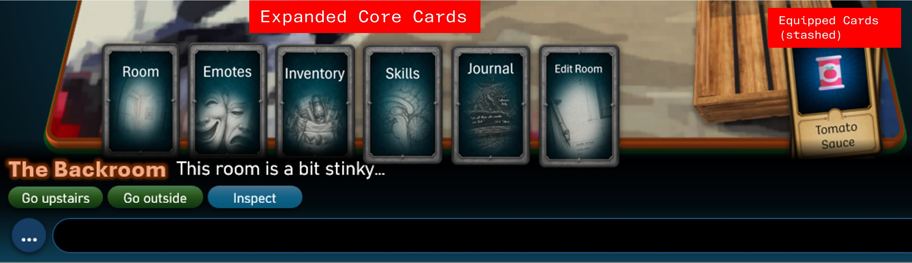

#### The Look Bar
The Look bar shows the name and description of the last selected entity (a peep,
a card, a prop, etc.) Both name and description fit on a single line. If the 
description is longer than that, overing the mouse on it (or touching it) shows
a popup with the full entity description.

The description bar is also used to display minor action feedback (eg, selecting
'Use' on a health potion when in full health may replace the description with 
`You don't need this`)

#### The Quick Actions Bar
The quick actions bar shows a list of actions that the user can take on the
currently selected entity. These actions depend both on the target, user, etc and
act as the equivalent of a 'context menu' for entities.

Quick actions are displayed as clickable Pills with different colors to indicate
the action category:
- Blue: default (eg. Use, Look actions)
- Green: alternative (eg. room exits)
- Dark Gray: disabled.
- Yellow: cancel-type action (eg. exit conversation)
- Red: negative-type action (eg. remove friend)0
#### The Chat Bar
The chat bar lets the user send chat messages or commands to the room. Commands
are special chat messages starting with the `.` character.
Thed `...` round icon on the left of the chat bar opens a popup menu with the 
full list of commands available to the user (with a search bar and help text for
each command)

### The Room View
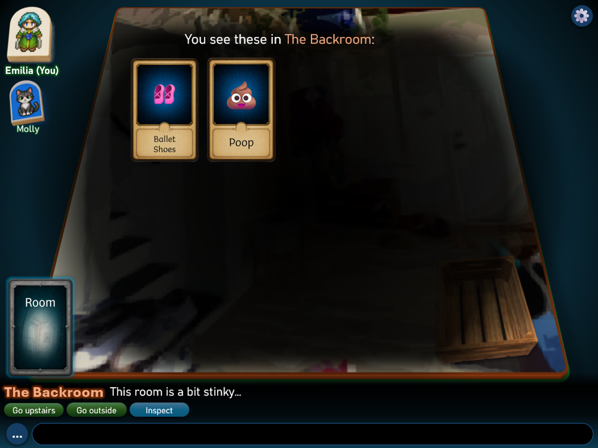

Selecting the Room Core Card opens the room view. The room view shows a list of
all the cards that have been placed in the room. Users and peeps can add or remove
cards from the room at any time (this is like dropping / picking up items).

A room owner may pin any of the room cards, indicating those cards cannot be picked up.

### Card Details View
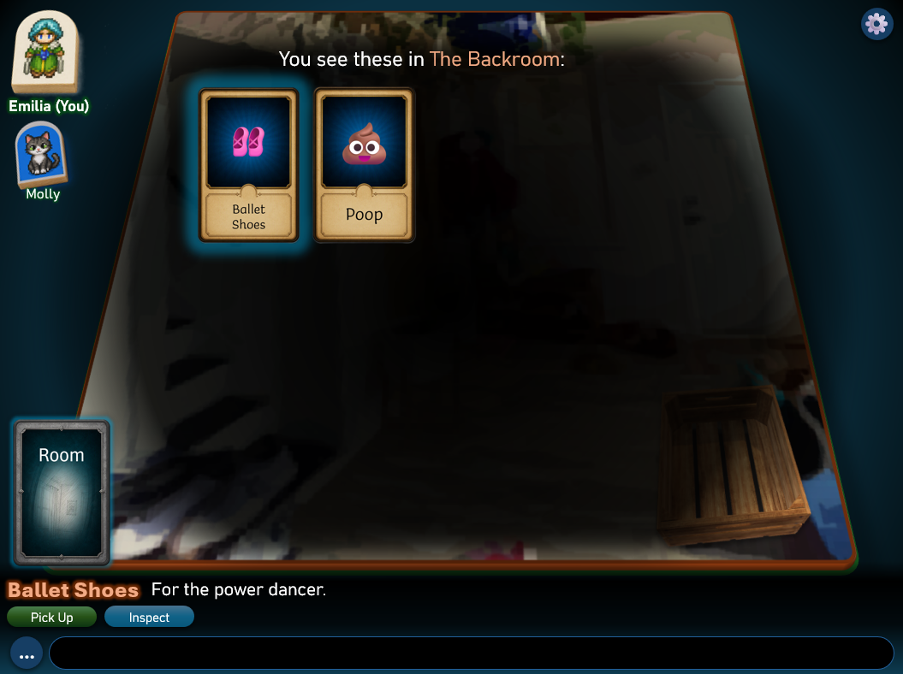

Selecting a Card (either in the Room View or in any other card display), shows
its name and short description in the look bar.

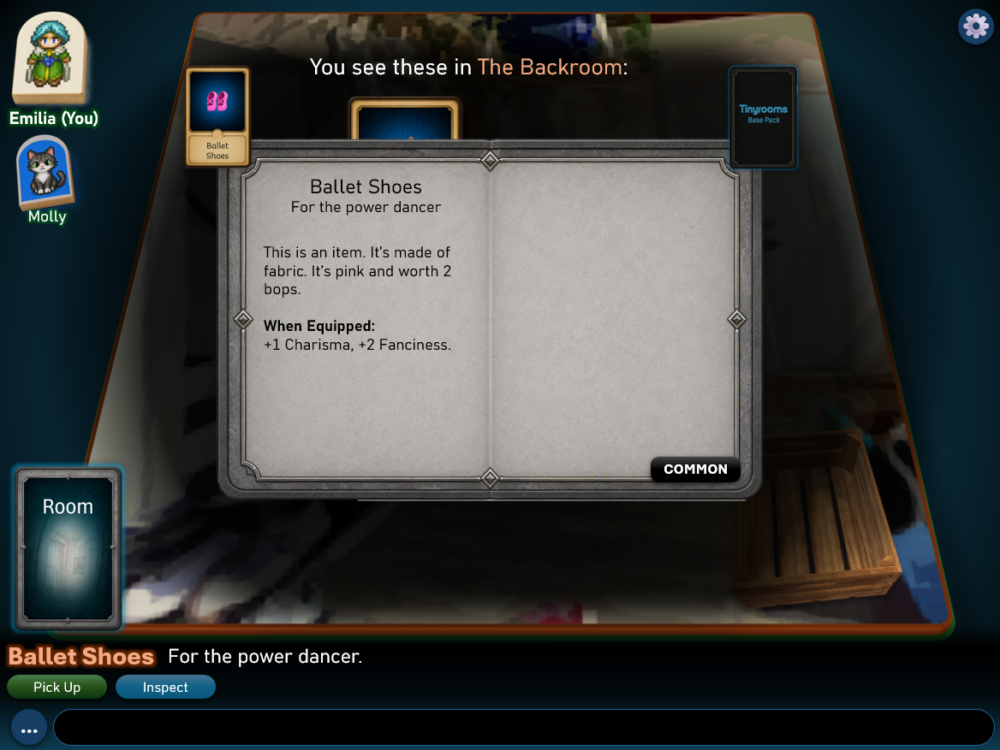

Selecting the `Inspect` quick action on a card shows the cards detail view.

The card details is shows as a popup with a book background, showing the following 
information on the selected card:
- the card front and back on the popup top left and right corners respectively
- the card rarity level on the bottom right corner.
- the card name and short description, longer description and stats on the book
left page.
- the right page is currently unused.

> Implementation note: while the card name and short descriptions are part of the
> card definition, the longer description text, equipped stats etc are generated
> based on the card stats / status etc. at runtime.

### Emotes View
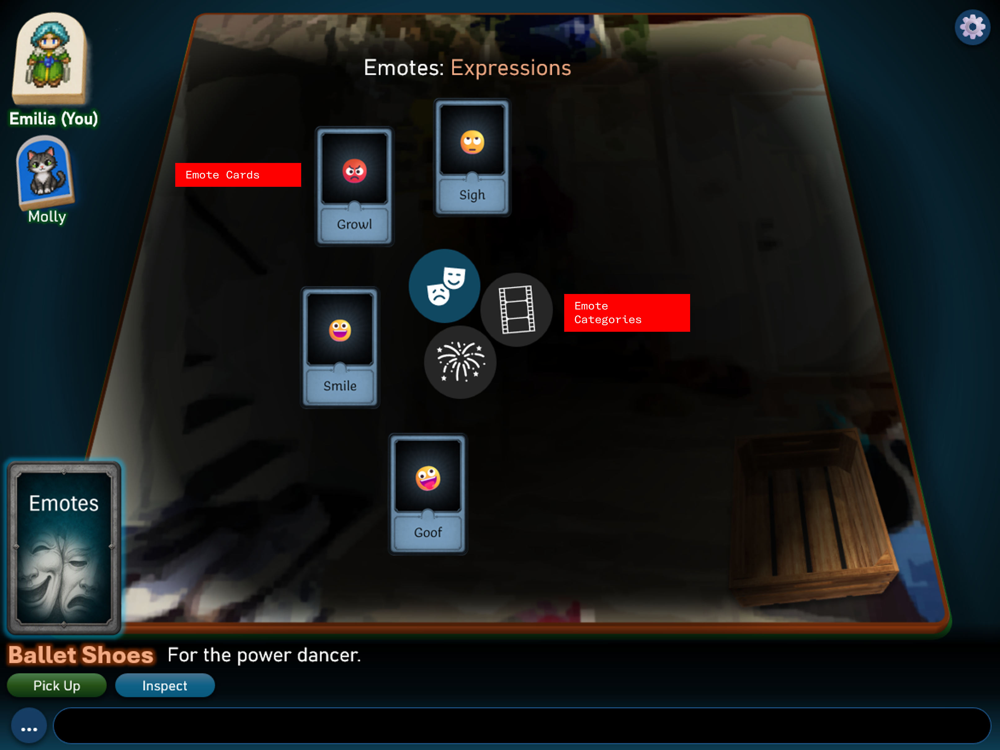

Selecting the Emotes core card opens the Emotes view. The Emotes view lets the
user play emote cards, which are cards that play visual effects, emojis and animations
with no direct gameplay effect. 

Emotes are grouped in three types (described below). A central set of buttons
lets the user choose the type. Equipped cards of the selected type are shown as a
circle around the central buttons.

The emote types are:
- **Expressions**: simple expressions displayed as large emojis in speech bubbles
(see below for a description of speech bubbles)
- **Animations**: are short animated emojir / gifs, also displayed in speech bubbles.
- **Effects**: are larger animations that affect the whole room. Animations are queued
and played in submission order from the room users.

### Speech and Emote Bubbles
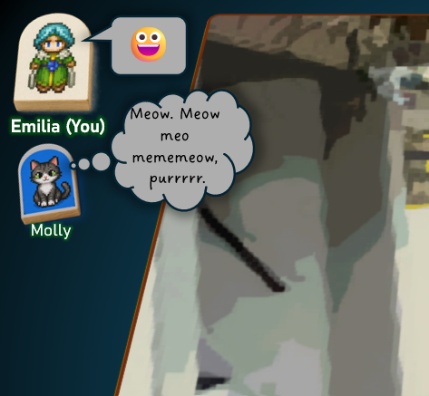

Speech bubbles are displayed next to peeps / users on the left sidebar. They are used to
display either chat messages from users or emotes (emojir/animations). Different
bubble styles are available (like thinking, normal and spiky text bubbles): users
can choose the bubble style for a chat message by adding `(.)`, `(!)` at the beginning
of a message to use the thinking or spiky bubble styles.

Speech bubbles remain visible on a client until a user touches / clicks on them.
They disappear with a zoom/fade out animation. If a user sends more than one chat
message, messages keep filling the bubble up to a pre-determined character limit,
then they replace old messages. The bubble text fond also automatically adjust
to fit longer messages.

### Selecting Peeps and Props
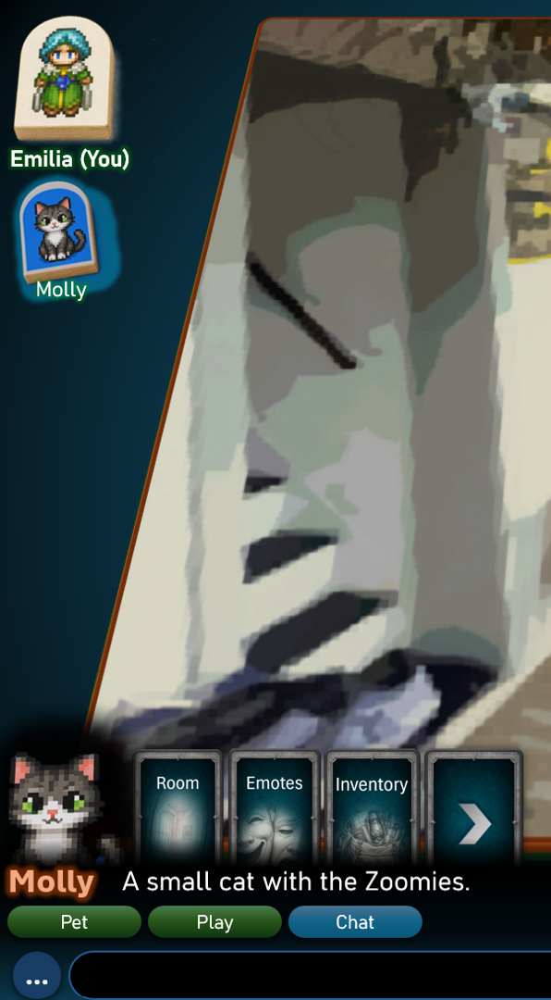
Clicking on a peep/user on the sidebar selects it. Selected peeps have a glowing background
and their name, short description and available quick actions are shown in the 
look box and quick actions area. The sprite for the peep is also displayed 
above the look box.

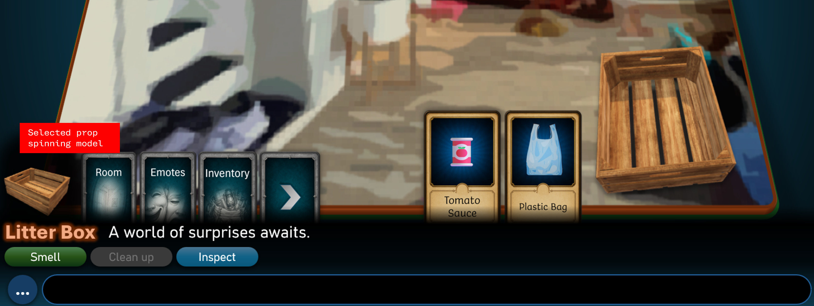
It is also possible to select Props (i.e. 3D objects placed in the room). 
A selected prop's 3D model is displayed (slowly spinning) above the look box.

#### Props Detail View
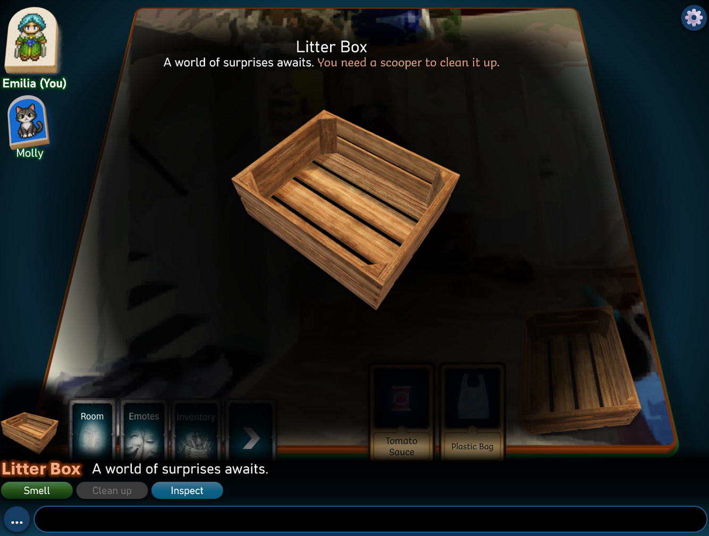
Selecting `Inspect` on a prop opens the prop details view. In this view the user
can look at and rotate the 3D model for a prop.

### Skills View
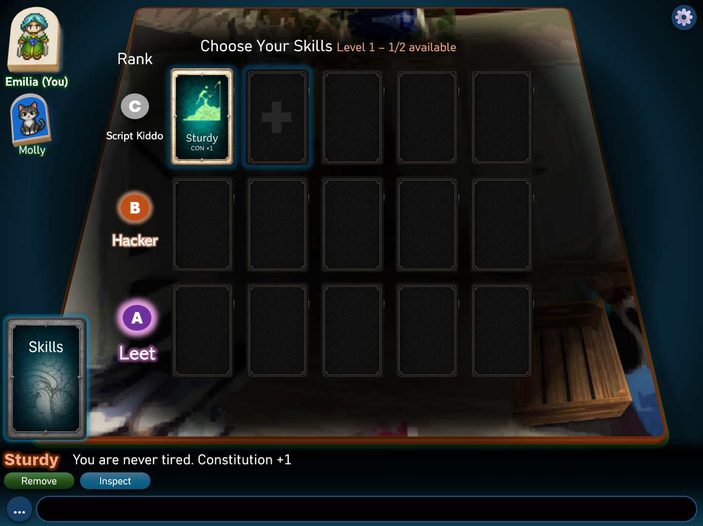

Selecting the Skills core card opens the skills view. The skills view allows 
the user to place special skill cards into a skill grid.

Skill cards provide permanent bonuses to the user. For instance, they can
increase any of the user stats.

Slots on the grid are enabled based on the user level (each level unlocks one 
more slot). When clicking on a slot, the user can choose a skill card directly 
from the inventory.

Skill cards have three ranks (script kiddo, hacker and leet). Cards of a higher
rank cannot be placed in a lower rank slot. Each rank has 5 slots, and slots 
are unlocked in order.

### The Inventory
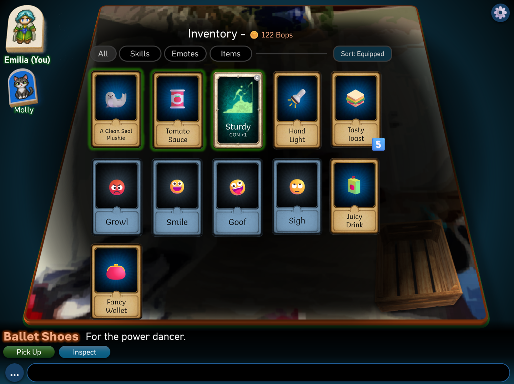

The inventory core card opens the user inventory. The inventory contains all the
cards owned by the user, grouped by card type, with basic filtering / sorting
options available. Multiple copies of the same card are displayed stacked, with
the stack size shown on top of the card. From the inventory, it is possible to
select cards, inspect them, equip them etc.

### Self View
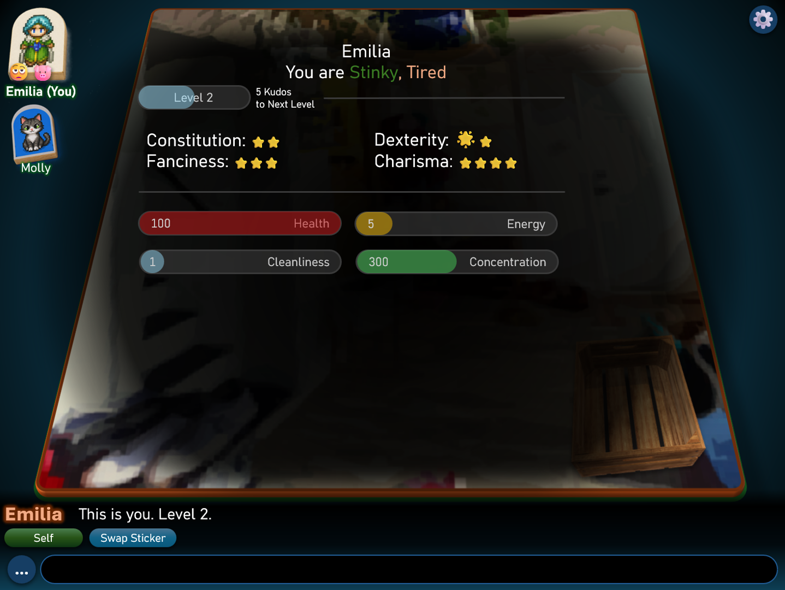

The self view core card open the user self view. This view shows information 
about the user peep, including their status, level, stats and counters (see
the gameplay section for more information on them)

### UI Implementation Notes
The Room View is implemented with Three.js

Both Quick actions and card actions are implemented as commands. It is possible
to execute a card or quick actions by typing the appropriate command (starting 
with `.`) in the chat bar.

-------------------------------------------------------------------------------
## Core Gameplay
The following sections describe the main aspects of tinyrooms gameplay mecchanics.

Tinyrooms is a sandbox, without a set goal. All of tinyrooms' mechanics 
are designed to be customizable to support different types of gameplay. 

Users control in-game characters (peeps) which have some unique properties compared
to NPC peeps. 

### User Level
Users have a level, which can be increased using Kudos. Kudos are gained
primarily by completing tasks and quests in game, but there are other ways to gain them.

When a user level increases, they can add more skills to their peep. Skills can 
increase Stats (like constitution, smarts, etc.). 

### Stats
Stats are core properties of a user's peep that can determine various aspects of gameplay.
The following are some basic stats (but additional stats can be defined through mods or custom worlds):
- **Constitution** determines the maximum value of the Health counter.
- **Dexterity, Charisma, Fanciness** affect how well some cards / actions work.

Stats generally remain static during gameplay, except for changes due to new skills
or temporary effects.

### Counters
Counters are used to represent properties of a character that change frequently 
during gameplay. Counters have a maximum value, that can be determined by the level
of some stats (like Constitution setting max health), by the user level or other
users' properties.
Some basic counters are:
- **Health**: when it goes to zero, the **Sick** status is applied to the user's peep
- **Energy/Juice**: it is consumed by any action the user takes (see **Juice**)
- **Cleanliness**: decreases depending on users, actions, when it goes to zero 
the **Stinky** status is applied to the user

> NOTE: The counter and status descriptions above are just an example of how 
> these systems could work. Everything is customizable through the tinyrooms 
> definition files and behaviors.

### Kudos
Kudos are one of the main "currencies" of the game. They are gained by completing
quests or other important in-game tasks (they cannot just be bought), and they
are spent to increase the user level. The exact number of kudos needed to progress
to each level is specified in one of the tinyrooms definition files (`data/core/levels.yaml`)

### Skills
Skills are gained by the user as their level increases. Each user's level unlocks
a skill slot, which can be filled with a skill card in the users' inventory. Skill
cards grant permanent bonuses to users, like increased stats, increased max values for
counters, etc. 

### Juice
Juice is the "short-term currency" of the game. It is used to refill the Juice Counter.
Juice is spent for most actions by the user, and it refills at a fixed rate determined
by the user level, skills etc. The standard juice rechange rate is 1 / min and the 
initial max juice for a level 1 user is 100. Various juice properties are set in the 
`data/core/juice.yaml` definition file.

When use get <= 0, the user cannot perform any other juice-consuming action until
juice level is back to at least 10% of its maximum value. Peeps of users without 
juice are displayed grayed out in the left sidebar, to indicate that they are
soft-disabled.
 

#### Juice Costs
These are indicative juice costs for some typical in-game actions:
- change room: 1
- play card: 2
- emote: 1
- animated emote: 3
- room animation emote: 5

### Bops
Bops are the standard in-game currency, used to buy card packs and other various
in-game items. Users get a fixed amout of bops daily depending on their level
Bop properties are defined in `data/core/bops.yaml`

-------------------------------------------------------------------------------
## Cards
Cards are one of the central gameplay mechanics of tinyrooms and represent the 
main way (together woth quick actions) for users to interact with a room, props
and peeps. Tinyrooms comes with a set of basic cards but additional cards can be
acquired through card packs. World can also define their own additional cards, but
these cards cannot transfer across worlds (they are disabled if the user is not
in the 'native' world that defined them).

Cards can be:
- emotes (emojis, animations or room effects)
- skills
- one-use items (ie the card is erased after use)
- generic items, including weapons, valuables and junk
- actions or other special definition cards.

Card definition yamls and related assets are defined in the `data/cardsets` subdirectories
and in the loaded world `cards` directory.

-------------------------------------------------------------------------------
## Status and Action Display
[...]

### Status Icons
> TODO: Image of status icons on a peep
[...]

### Toasts
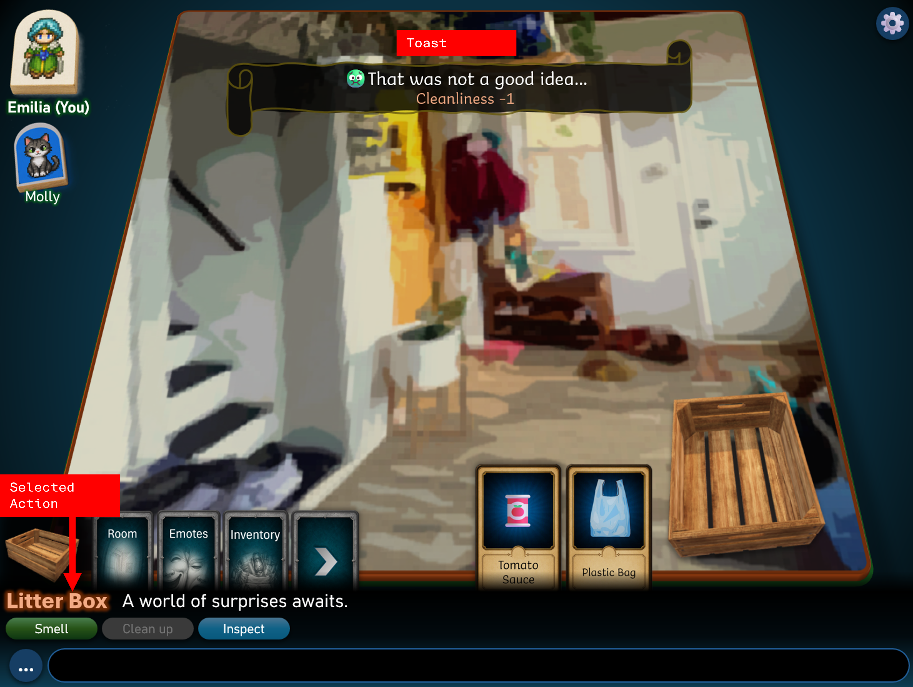
[...]

### Counter Overlays
[...]

### Card Target Selection
> TODO: mockup screen of card target selection
[...]

-------------------------------------------------------------------------------
## Room Design
Rooms are generally represented as game boards with a custom board background design
(which for instance can be a picture or representation of the room environment).
The board can be rotated in 3D inside the user client. 3D objects (called Props) 
can be placed on the room board by the room owner/world designed. Props can just
be used for aesthetic reasons (eg to add natural elements or buildings to the flat
board), or they can be active game elements (when the props have a behavior script
attached).

### Exits
Rooms are connected to each other through exits. Available exists are shown as
quick actions when looking at the room (and are displayed by default when entering
the room for the first time). Selecting the quick action to take a specific exit
moves the user to that room. 

### Environment and Effects
Rooms can have both an enviroment defined on them, which affects how the room
is displayed (for instance it is possible to apply visual effects like fog, night, etc)
Rooms can also have status effects that affect all peeps in the room. Status effects
are recalcutaned and applied on each room tick.

### Room Editing
Room owners can edit a room by using the `Edit Room` core card. In-game room 
editing is more limited and allows the user to:
- add / remove and edit the placement of props
- add / remove room cards
- modify other room properties like the enviroment display, room status effects etc.

-------------------------------------------------------------------------------
## Props
Props are 3D objects placed on the room game board. They can be animated and 
display various graphical effects, and they can be used both to enrich the game
visuals and to serve as active pieces of gameplay. For instance a chest prop
may be unlocked to reveal more cards, some props may require some cards to be 
played on them to unlock quest progression, or some props may be used to represent
challenges / enemies to fight in the room.

Props are grouped into **propsets**: A propset is a directory containing a group
of related prop definitions, their 3D models and any other assets they require.

Worlds can also define their own custom props in the relative world `props` directory.

### Prop Display
Props are displayed as 3D models. Players cannot pick up or modify props (unless they
are room owners and are editing the room), but they can otherwise interact with
them by selecting them, inspecting them, executing quick actions (if defined for the prop)
or playing cards on them.

-------------------------------------------------------------------------------
## Worlds
Worlds are self-contained collections of rooms, peeps and cards that run on a tinyroom
server. Each tinyrooms server runs a single world. Worlds are stored as a set of definition
files which contain the initial room definitions, and a worldstate database, used to
represent the dynamic, live state of the world (eg to store the position of peeps
during gameplay, the status of props, room cards etc.)

### World Editor
The world editor is available on the web server under url `world-editor`, when the
world-editor feature is enabled. The world editor lets users fully build and
modify the currently loaded world. Through the world editor users can:
- create and delete rooms
- edit all room aspects including the board picture, props, initial room cards, etc.
- edit room connections through exits
- place, edit and delete NPC-based peeps 

-------------------------------------------------------------------------------
## Peeps
Peeps are the tinyroom implementation of active characters. Peeps can be either
user-controlled or NPCs governed by **behavior scripts**.

All peeps in a room are displayed in a vertical column on the left side of the
game screen, overlaying the room view. Peeps are displayed as sprites overlayed on a 
3D solid 'marker' that represents the peep as if it was a real board piece.  

NPC Peeps are used to implement all types of non-player characters, from simple 
creatures to merchants, quest givers, dialog characters and fully AI-controlled bots.

Peeps are defined in yaml files in the loaded world `peeps` directory.

### Peep Behaviors
NPC Peeps are controlled by behavior scripts. Behavior scripts are python files
placed in the same directory as the peep definition yamls. Behaviors can define 
custom logic for the following game events:
- tick events from the room (by default room ticks each 1 second)
- any card play targeting the peep
- any quick action executed on the peep

### Dialogs
NPC Peeps can respond to actions by opening a dialog tree: dialogs are shown in
the UI through the look box (with quick actions used to choose the next action
in the dialog)

-------------------------------------------------------------------------------
## Activities
[...]
 
### Activity Implementation
[...]

-------------------------------------------------------------------------------
## The Journal
[...]

### Quests
[...]

### Memories
[...]

-------------------------------------------------------------------------------
## Friends
[...]

-------------------------------------------------------------------------------
## Commands and Administration
All user interaction (includign quick actions, card plays, chat messages, etc.)
are sent to the server in the form of `command strings`. Commands generally start with a
`:`.

### User Powers
Users can have one or more powers, that determine the set of commands they have access to:
- admin: can send admin commands to the server from the client
- realtor: can grant, remove, and modify ownership of rooms
- builder: can modify any rooms regardless of ownership, can use the world editor and commands to create / remove rooms.
- moderator: can control other users, including mute/kick them.
- game-master: can control all gameplay aspects and rules.

### Command types
- **Normal commands** start with `:` and run in-world (for example `:look`).
- **Admin console commands** start with `/` and are forwarded to server console execution for users with `admin` power (except `/r` and `/k`, which are blocked from client use).

Normal commands in the form `:cmd` can have different required permission levels
(for instance a command to kick a player can only be executed if the user has `moderator` powers)

## Target token formats

Many commands take a `<target>` token:

- `@obj:<obj_id>`: object (in room or your inventory, depending on command)
- `@prop:<prop_instance_id>`: prop in current room
- `@peep:<peep_id>` or `@<username>`: peep/user in current room
- `@way:<way_id>`: room exit (for `:go`)