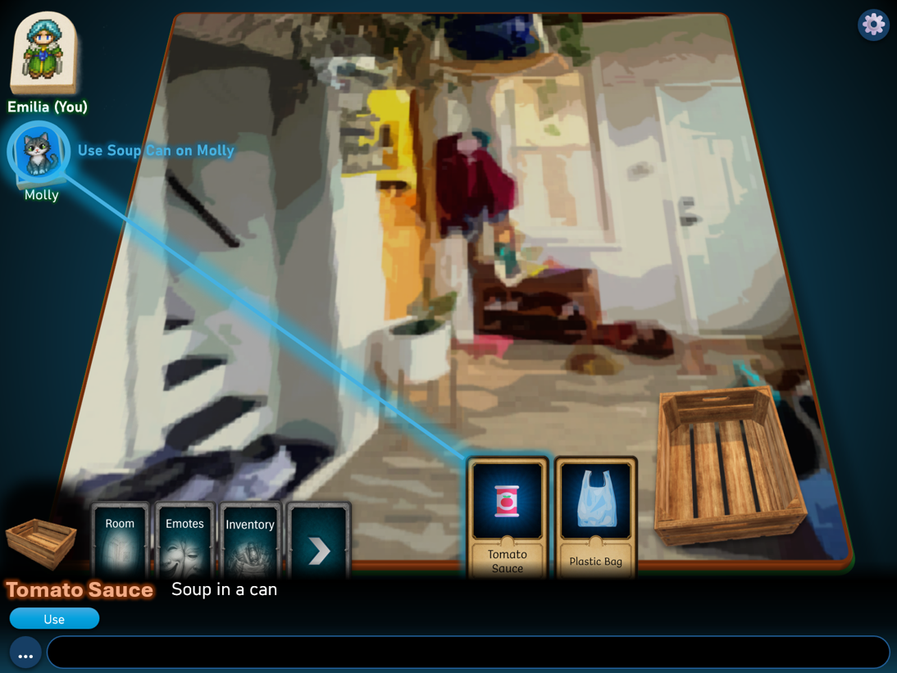
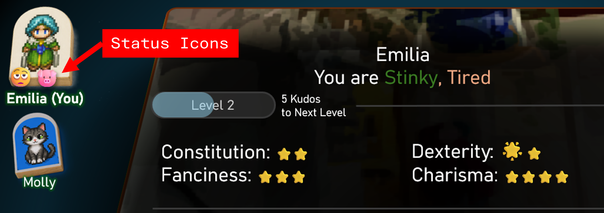
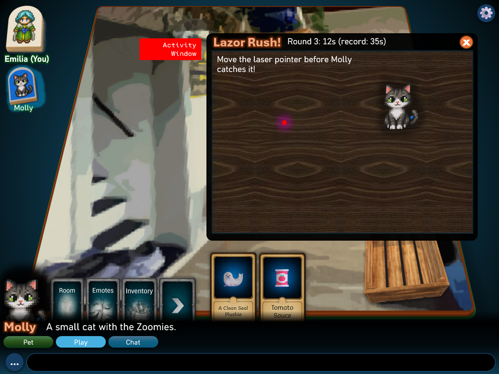
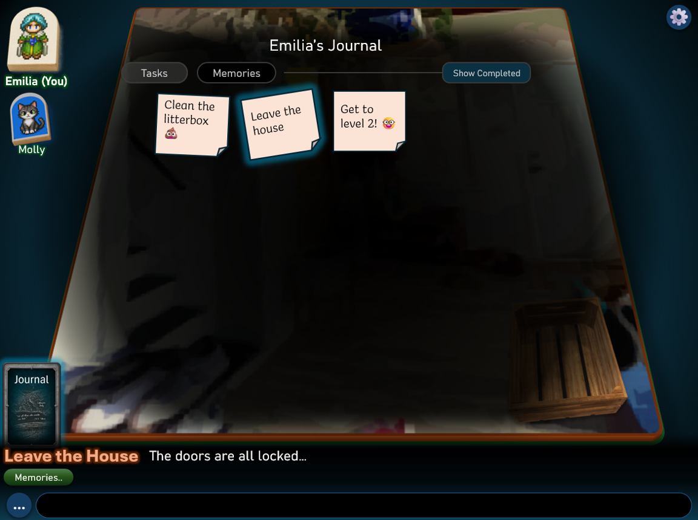
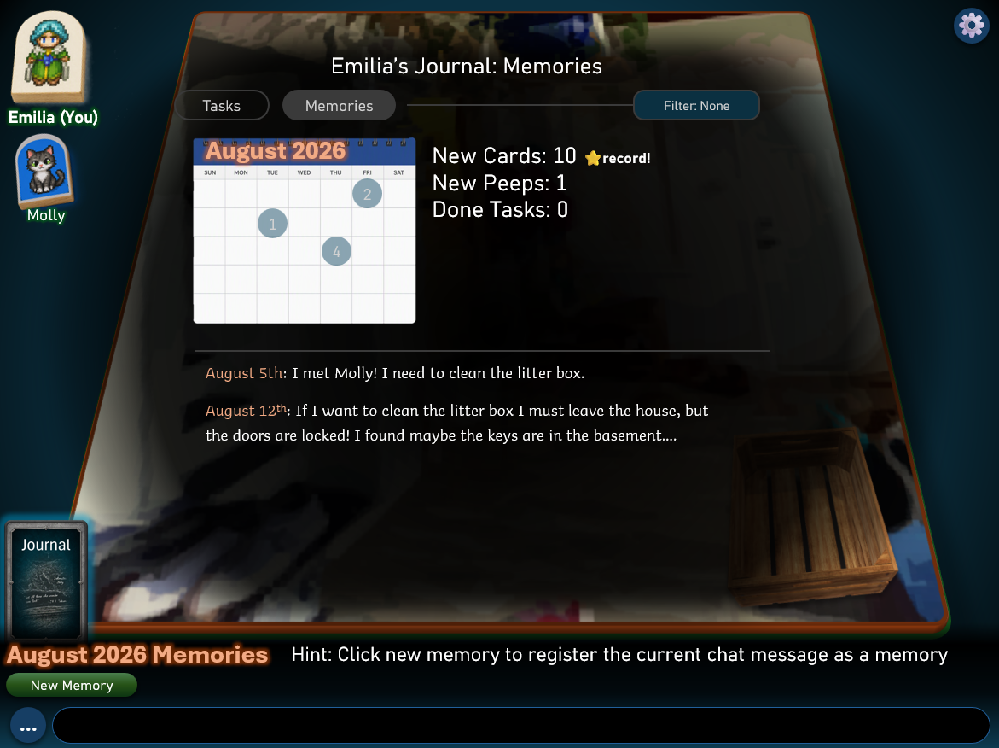

# Tinyrooms Design
This document describes the design of Tinyrooms, a multiplayer web-based game
where users can join and move across virtual rooms which are displayed as game
boards in a 3D view.

This document defines the required gameplay and interaction behavior. Screenshots
establish visual direction; their example names, descriptions, values, and
incidental UI states are illustrative unless explicitly adopted in the text.
Referenced data files define configuration values only where this document
explicitly delegates those values to them. Any remaining conflict between these
sources must be clarified before implementation planning rather than resolved by
assumption.

Technical constraints and implementation notes are maintained separately in the
[implementation brief](./prompt.md).

Users interact with the room and other peeps primarily by using **cards**
which can be collected, bought and found throughout the game. Cards represent
items, actions, skills, emotes, and more.

The core design principles of Tinyrooms are:
- **Simplicity**: the base game mechanics and interactions should be easy to grasp.
Most items on the UI should be interactive and do something, encouraging user exploration.
- **Modularity**: this game is a sandbox. It is possible to add new worlds, card sets, NPC behaviors, etc.
The entire game system should be designed to make it possible for AI agents to easily build
extensions to the game.
- **Learnability**: the codebase should be easy to learn and follow. The codebase itself is a
teaching tool for a game design class.

### Initial Release Scope
The initial implementation plan covers all core systems described in this
document. Features explicitly identified as future work are excluded from the
initial release, including the more complex Sticker Designer.

Support for custom worlds and mods is an extension capability, not a requirement
to invent unlimited additional content. The content included with the initial
release must be explicitly defined.
Tutorial layouts, named-card catalogs, and tutorial-specific rewards belong in
the [implementation brief](./prompt.md), not in this reusable gameplay design.

### Terminology
- **User**: a human participant. This document uses "user" rather than alternating
  between "user" and "player".
- **Account**: the user's login identity and associated profile.
- **Peep**: an in-game character, controlled either by a user or by NPC behavior.
- **User-controlled peep**: the character controlled by a user.
- **NPC**: a peep not controlled by a user.
- **Board**: the central 3D room scene, including its floor and props.
- **Room View**: the overlay listing cards placed in the current room, opened
  from the selected room's `Open Room View` quick action.
- **Inventory**: all cards owned by a user, including equipped cards.
- **Equipped cards**: owned item or action card stacks selected for active use in
  the Card View. Each stack uses one equipped-card slot, regardless of its size.
  Skill cards are slotted separately; emote cards do not need equipping.
- **Task**: an objective tracked in the Journal, which may contain multiple steps.
  Quests are not a separate gameplay concept.
- **Card type**: a card's gameplay role, such as an item, emote, or skill.
- **Core card**: a non-collectible control for a built-in action or view, not an
  inventory item.
- **Skill rank**: a skill card's slot eligibility category: Script Kiddo, Hacker,
  or Leet.
- **Rarity**: a card's pack availability category: Common, Uncommon, Rare, Epic,
  or Legendary. Rarity is separate from skill rank and user level.
- **Visual effect**: an animation or other presentation change; it does not itself
  change gameplay values.
- **Buff**: a temporary gameplay modifier that may be beneficial or detrimental.
- **Status**: a named buff with defined application and clearing conditions,
  such as Sick, Stinky, or Tired.

An action may produce both a visual effect and a gameplay modifier.

### Document Guide
- [Users and starting state](#users)
- [UI and interaction views](#ui)
- [Core gameplay](#core-gameplay)
- [Cards and equipment](#cards)
- [Card actions and crafting](#card-actions)
- [Buffs and statuses](#peep-buffs-and-status-icons)
- [Rooms](#room-design), [props](#props), and [worlds](#worlds)
- [Peeps and dialogs](#peeps)
- [Activities](#activities)
- [Journal](#the-journal)
- [Commands and powers](#commands-and-administration)

-------------------------------------------------------------------------------
## Users
To join Tinyrooms, a user must create an account on the server. When connecting
to the server for the first time, the user gets a simple login screen asking for
a username and password. This screen also has a `Create New Account` button.

### Account Creation
The `Create New Account` dialog asks the user for a unique username, password, and
a special passphrase set on server startup, which must be used to create new accounts.

Once the user chooses valid credentials, they are taken to the
`Sticker Designer`. The Sticker Designer lets the user customize how their
peep is displayed in game (in the Peeps List left sidebar). While a more complex
sticker designer will be available in the future, the current one lets users choose
one of the pre-built stickers in `data/stickers`.

Choosing the first sticker during account creation is free.
Once valid credentials are created, the account is retained even if sticker
selection is interrupted. The next login resumes the Sticker Designer, and the
user cannot enter the world until the initial sticker choice is confirmed.

> NOTE: The Sticker Designer is an [Activity](#activities).
> During account creation, it is fully modal and must be completed before entering
> the world. This is an exception to the ordinary non-modal activity window.

### Starting State
New users start at level 0, labeled **Guest**. This is a progression label, not
anonymous access; an account is still required. At level 0, the equipped-card
limit is 5, maximum Energy is 80, and no skill slots are unlocked.
The starting balances are 10 Bops and 0 Kudos, before any daily claim or task reward.
Base Constitution, Dexterity, Charisma, and Fanciness each start at 1, before
skill, equipment, or buff bonuses.
Health, Energy, and Cleanliness start at their final maximums after the starting
loadout is applied. Without starting modifiers, these values are 50 Health,
80 Energy, and 100 Cleanliness. New peeps start without Sick, Tired, or Stinky.
At account creation, each new user receives one copy of each base Expression
emote: Smile, Sigh, Growl, and Goof.
These are the only collectible cards granted at account creation; all
equipped-card slots start empty. No Energy-refill card is granted initially.

### Offline Peeps
When a user disconnects, their peep leaves active room participation and is no
longer exposed to room auras, NPC actions, or room-based counter changes. Their
last room is remembered. Offline Energy recharge and already-applied timed buffs
continue to follow their normal elapsed-time rules.

On login, returning users resume in their remembered room. If that room has
been deleted or is no longer accessible, they enter the world's designated entry
room instead and are shown an explanation.

### Active Session
An account can have only one active gameplay session across all cooperating
servers. A successful login from another browser session or entry into another
world replaces the previous session, which is notified that it has been signed
out and can no longer perform actions in its previous world.

-------------------------------------------------------------------------------
## UI
The Tinyrooms UI is a web app. Its primary screen
displays a 3D room rendering in the center, peeps on the left, and a
primary interaction area at the bottom. Overlay UIs can be displayed on top of
the primary screen.

Inventory, Room View, Skills View, Journal, Self View, Emotes View, and Prop Details
View are **Board-modal views**: they block interaction with the Board behind them,
but the Peeps List, Look Bar,
Quick Actions Bar, and Chat Bar remain usable. Their bottom-bar actions apply to
the current selection. Opening a view does not pause the shared world.
Activity windows are non-modal unless explicitly described otherwise.
Card Details is a nested popup over the view from which it was opened.
Only one main Board-modal view is open at a time; opening another replaces it.
Closing Card Details returns to its parent view.
Opening a main view resets the Look Bar and Quick Actions Bar to that view's
context until another entity is selected. Selecting a peep while a view is open
updates the bars to that peep. Stale entity text or actions shown in the mockups
are illustrative, not required behavior.
When the selected entity disappears or a main view closes without opening a
replacement view or starting targeting, selection returns to
the current room, showing its description and exits. Closing only Card Details
keeps its card selected in the parent view if that card is still available.

Every Board-modal view and nested popup has a visible `Close` control. On a
keyboard, Escape cancels active targeting first; otherwise it closes the topmost
popup or view. Re-selecting the core card for the currently open view toggles
that view closed. Activity windows retain their own explicit Close control.

> NOTE: In the screenshots below, red boxes with white text are labels/notes; they
> are NOT part of the UI.

### Main Screen

The Tinyrooms main screen has the following main components (labeled with red 
boxes in the screenshot above):
- The Board (center)
- The Peeps List (left)
- The Card View (bottom)
- The Look Bar (bottom, under the Card View)
- The Quick Actions Bar (bottom, under the Look Bar)
- The Chat Bar (bottom, under the Quick Actions Bar)

#### The Board
The Board is displayed in the middle of the game screen. The "Room View" label
in the screenshot above is outdated and refers to the Board, not the Room View
overlay. A room is displayed as
a floor that can be freely rotated / zoomed by the user. The floor may have 
3D objects and other features on it (Props). At minimum, rooms can have a different 
floor texture, but other more complex room displays are also supported.

#### The Peeps List
The Peeps List shows the list of peeps in this room (both user-controlled peeps and NPCs).
The user's own peep is displayed at the top left, slightly larger than the others.

Users can **pin / unpin** peeps (through a quick action on a selected peep).
Pinned peeps take precedence in the Peeps List ordering. When too many peeps are
in the room to display individually, pinned peeps are still displayed
individually, while unpinned peeps are collapsed into a single **peep group**
entry that can be expanded to see the individual peeps.

#### The Card View
The Card View shows a list of cards, which represent actions the user can take.
The Card View is split into core cards and equipped cards.

**Core** cards are displayed on the left and represent core gameplay actions or
submenus like checking the inventory or opening the list of available emotes.
They are non-collectible controls: they do not appear in card packs, cannot be
dropped or traded, and use no equipment slots.
Core card availability can depend on permissions and the room. Inventory,
Emotes, and Journal are available from the start in the tutorial and are always
displayed in a fixed order. Room View and Skills are opened from quick actions
rather than core cards. The tutorial teaches these views gradually rather than
locking them; Skills initially has no unlocked slots.

**Equipped** item and action stacks are displayed beside the core cards. Their
capacity, eligibility, and passive bonuses follow the [Equipment](#equipment)
rules. Skills use a separate grid; owned emotes are available through Emotes View
without equipping.

The user's own peep offers `Open Self`, `Friends`, and `Skills` quick actions. A
room the user owns offers an `Edit Room` quick action, which opens the
room-editing view; a selected room offers `Open Room View`.

#### The Look Bar
The Look Bar shows the name and description of the last selected entity (a peep,
a card, a prop, etc.). Both name and description fit on a single line. If the
description is longer than that, hovering over it (or touching it) shows
a popup with the full entity description.

The Look Bar is also used to display minor action feedback (e.g., selecting
'Use' on a health potion when at full health may replace the description with
`You don't need this`).

#### The Quick Actions Bar
The Quick Actions Bar shows a list of actions that the user can take on the
currently selected entity. The available actions depend on factors such as the
target and the user, and serve as the equivalent of a 'context menu' for entities.

Quick actions are displayed as clickable pills with different colors to indicate
the action category:
- Blue: default (e.g., Use, Look actions)
- Green: alternative (e.g., room exits)
- Dark Gray: disabled
- Yellow: cancel-type action (e.g., exit conversation)
- Red: negative-type action (e.g., remove friend)

#### The Chat Bar
The Chat Bar lets the user send chat messages or commands to the room. Normal
commands start with `.`; privileged console commands use the separate syntax
described under [Command Types](#command-types).
The `...` round icon on the left of the chat bar opens a popup menu with the 
full list of commands available to the user (with a search bar and help text for
each command).

#### The Action Log
The Action Log is a collapsible text panel that lists recent actions and events
in the room (chat messages, action results, peeps entering / leaving, etc.) as
scrolling text lines. It is hidden by default and can be toggled through the
client settings.

### The Room View

Selecting the room and choosing `Open Room View` opens the Room View, listing
cards placed in the room. Peeps can add or remove cards through drop and pickup
interactions, subject to the ownership, pinning, and skill-slot rules below.

The room owner and other users authorized to edit the room can pin or unpin room
card stacks. Pinning applies to the whole stack and prevents everyone, including
the owner, from picking it up until an authorized editor unpins it.
Pinning and unpinning do not create or consume cards.

Users may drop a chosen quantity from an owned item or action stack, including
an equipped stack. Dropped copies leave the user's inventory and stop contributing
equipment bonuses. Dropping part leaves the remaining stack equipped; dropping
the entire equipped stack frees its slot.

Picking up a room stack also allows choosing a quantity. Pickup and drop cost no
Energy by default. Pinned room cards cannot be picked up.
Room item and action cards can be inspected but cannot be played where they are,
pinned or not. They must first be picked up and equipped; pinning only restricts
pickup.

Skill and emote cards may also be dropped and picked up. A slotted skill copy
must first be removed from its skill slot before it can be dropped. Dropping
the last owned copy of an emote removes it from the user's Emotes View.
Core cards cannot be transferred.

### Card Details View

Selecting a card (either in the Room View or in any other card display) shows
its name and short description in the Look Bar.

Selecting the `Inspect` quick action on a card shows the Card Details View.

The Card Details View is shown as a popup with a book background, showing the following 
information on the selected card:
- the card front and back in the popup's top-left and top-right corners, respectively.
- the card rarity in the bottom-right corner.
- the card name, short description, longer description, and stats on the book's
left page.
- the right page is currently unused.

The longer description and equipment information reflect the card's current
stats and status.

### Emotes View

Selecting the Emotes core card opens the Emotes View. The Emotes View lets the
user play emote cards, which produce visual effects, emojis, and animations
without gameplay modifiers. Playing them still has the configured
[Energy cost](#energy-costs).

Emotes are grouped into three types (described below). A central set of buttons
lets the user choose the type. Owned emote cards of the selected type are shown as a
circle around the central buttons.

The emote types are:
- **Expressions**: simple expressions displayed as large emojis in speech bubbles
(see below for a description of speech bubbles).
- **Animations**: short animated emojis / GIFs, also displayed in speech bubbles.
- **Effects**: room-wide visual effects. These visual effects are queued
and played in submission order from the room users.

### Speech and Emote Bubbles

Speech bubbles are displayed next to peeps on the left sidebar. They are used to
display either chat messages from users or emotes (emojis/animations). Different
bubble styles are available (like thinking, normal and spiky text bubbles): users
can choose the bubble style for a chat message by adding `(.)` or `(!)` at the beginning
of a message to use the thinking or spiky bubble styles.

Speech bubbles remain visible on a client until a user touches / clicks on them.
They disappear with a zoom/fade-out animation. If a user sends more than one chat
message, messages keep filling the bubble up to a predetermined character limit,
then they replace old messages. The bubble text font also automatically adjusts
to fit longer messages.

### Selecting Peeps and Props

Clicking on a peep on the sidebar selects it. Selected peeps have a glowing background
and their name, short description and available quick actions are shown in the 
Look Bar and Quick Actions Bar. The sprite for the peep is also displayed 
above the Look Bar.

It is also possible to select Props (i.e. 3D objects placed in the room). 
A selected prop's 3D model is displayed (slowly spinning) above the Look Bar.

#### Prop Details View

Selecting `Inspect` on a prop opens the Prop Details View. In this view the user
can look at and rotate the 3D model for a prop.

### Skills View

Selecting the user's own peep and choosing the `Skills` quick action opens the
Skills View. The Skills View allows the user to place special skill cards into a
skill grid.

Selecting a slot lets the user choose a skill card from Inventory. Slot
availability, rank eligibility, bonuses, and removal follow the [Skills](#skills)
rules.

> NOTE: The skills screenshot above shows "Level 1 – 1/2 available"; the
> level-based slot rule in [Skills](#skills) takes precedence over the screenshot.

### The Inventory

The Inventory core card opens the user's inventory. It shows owned cards
available in the current world, grouped by card type, with basic filtering / sorting
options available. Inventory capacity is unlimited in the initial release;
per-card stack limits and equipped/skill-slot limits still apply.
Copies of stackable cards are displayed in stacks up to the
card's stack limit, with the stack size shown on top of the card. Non-stackable
cards are displayed individually. From the inventory, it is possible to
select cards, inspect them, equip them, etc. Equipped item and action stacks can
be played from Inventory or the Card View. Unequipped stacks must be equipped first.

Stackable cards provide `Split Stack` and `Merge Stacks` actions. Splitting creates
another stack with a user-chosen number of copies. Merging moves copies between
stacks of the same card, up to the destination stack's limit. Non-stackable cards
do not provide these actions.

Reorganizing preserves each existing stack's equipped or unequipped state.
Newly split-off stacks start unequipped. Changing the count of an equipped stack
updates its bonuses; emptying it frees its slot. Reorganization does not
automatically equip additional stacks.

The Inventory header shows the user's Bops balance. A `Claim Daily Bops` quick
action lets the user claim the daily allowance.

### Self View

Selecting the `Self` quick action on the user's own peep (in the Peeps List)
opens the Self View. This view shows information 
about the user's peep, including statuses, level, stats, and counters (see
[Core Gameplay](#core-gameplay)).

Self View provides a `Level Up` action for spending Kudos to increase the user's
level.

The `Swap Sticker` quick action (also available when the user's own peep is
selected) reopens the Sticker Designer activity, letting the user change their
peep sticker. Swapping stickers costs Bops: the cost is defined in
`data/core/bops.yaml` (`sticker_swap_cost`, default 10).
The charge applies only when the user confirms a different sticker. Opening the
designer, cancelling, or confirming the current sticker does not spend Bops.
Later Swap Sticker visits use a cancellable, ordinary non-modal activity window.
Swap Sticker is globally accessible within the user's current world rather
than tied to a room prop or NPC.

### Friends
Users can add other users as friends. The friends list is managed through a
separate Friends panel, opened with the `Friends` quick action on the user's own
peep. From the Friends panel the user can see their friends (including which
ones are online), and remove friends. Friends can be added through the
`Add Friend` quick action on another user's peep (the other user must accept the
request). The friends list is part of the shared user profile, and Journal
monthly progress includes the number of new friends made in the month.
Incoming and outgoing requests are managed in the Friends panel and remain
pending until accepted, declined, or cancelled, including while a user is
offline. Acceptance creates a mutual friendship; either user can remove the
friendship for both.

-------------------------------------------------------------------------------
## Core Gameplay
The following sections describe the main aspects of Tinyrooms gameplay mechanics.

Tinyrooms is a sandbox, without a set goal. All of Tinyrooms' mechanics
are designed to be customizable to support different types of gameplay. 

Users control in-game characters (peeps) which have some unique properties compared
to NPCs.

### Game Calendar
Daily Bops, day-based buffs, and Journal dates and months use one configured
timezone across a cooperating-server group, defaulting to UTC. A game day begins
at midnight in that timezone. All cooperating servers and their users share the
same calendar boundaries.

### User Level
Users have a level, which can be increased using Kudos. Kudos are gained
primarily by completing tasks in game, but there are other ways to gain them.

Each level unlocks a [skill slot](#skills); skills can increase stats such as
Constitution or Charisma. Leveling follows the manual [Kudos](#kudos) spending rule.

### Stats
Stats are core properties of a user's peep that can determine various aspects of gameplay.
The following are some basic stats (but additional stats can be defined through mods or custom worlds):
- **Constitution** determines the maximum value of the Health counter.
- **Dexterity, Charisma, Fanciness** affect how well some cards / actions work.

Stats generally remain static during gameplay, except for changes to slotted
skills, equipped card stacks, or temporary buffs.

Effective core stats have a minimum of 0 after modifiers are applied.
Core stats are whole numbers. Combine [modifiers](#modifier-combination), round
down once, and then apply the minimum of 0.

### Counters
Counters are used to represent properties of a character that change frequently 
during gameplay. Their maximums can depend on stats (such as Constitution for
Health), user level, or other properties of the peep.
Some basic counters are:
- **Health**: when it goes to zero, the **Sick** status is applied to the user's peep.
- **Energy**: it is consumed by most actions the user takes (see **Juice and Energy**).
- **Cleanliness**: decreases depending on users and actions; when it goes to zero,
the **Stinky** status is applied to the user's peep.

Health, Energy, and Cleanliness stay between 0 and their current maximums.
Changes beyond those bounds are discarded rather than stored as surplus or debt.
Core counter maximums are whole numbers, rounded down once after combining
their modifiers, with a final minimum of 1. Current counter values may retain
fractions so passive recharge
and percentage-based changes accumulate without losing partial points.

The core maximum Health rule is `max(50, 50 * effective Constitution)`.
Constitution 0 or 1 gives 50 maximum Health; Constitution 2 gives 100.
The positive minimum keeps healing possible even when Sick reduces Constitution
to 0. This formula establishes the base maximum before any direct maximum-Health
modifiers. The final maximum still follows the core counter minimum of 1.
Worlds may override this default formula.

Changing a counter's maximum does not change its current value unless that value
exceeds the new maximum, in which case it is reduced to the new maximum.
Increasing a maximum does not refill the counter.

Cleanliness has a core base maximum of 100. Worlds may override this default,
and skills or buffs may modify the maximum.

Health does not regenerate and Cleanliness does not decay passively by default,
whether the user is online or offline. They change through gameplay actions or
explicitly defined effects. Worlds may add passive changes; Energy is the only
core counter with automatic recovery by default.

Worlds and mods can define additional custom counters with their own gameplay
meaning (for example, the **Concentration** counter shown in the Self View
screenshot is a custom counter with no core-game meaning).

Health, Energy, and Cleanliness, together with the Sick, Stinky, and Tired status
rules, are shipped core defaults rather than illustrative examples. Worlds can
override or extend these defaults.

### Kudos
Kudos are one of the main "currencies" of the game. They are gained by completing
tasks or other important in-game objectives (they cannot just be bought), and they
are spent to increase the user level. The exact number of Kudos needed to progress
to each level is specified in one of the Tinyrooms definition files (`data/core/levels.yaml`,
as the per-level `kudos_to_next` field). The same file also defines the per-level
equipped-card slot limit (`max_equipped`), counted as equipped stacks rather than
individual copies.

Level advancement is manual: the user selects `Level Up` in Self View to spend
the required Kudos and advance to the next level. Earning Kudos does not
automatically increase the user's level.

The shipped maximum level is 15. Leveling spends only the Kudos required for the
next level; any remaining balance is retained. At level 15, users continue to
earn and retain Kudos, and earned Kudos still count toward Journal progress,
but no further Level Up action is available.

### Skills
The number of unlocked skill slots equals the user's level: level 0 has no
unlocked slots, and level 15 has all 15 slots. The grid has three ranks of five
slots each, unlocked in order: Script Kiddo, Hacker, then Leet. A card cannot be
placed in a slot of lower rank than the card.

Each slot can hold a skill card from the user's inventory. Slotted skills do
not use ordinary equipped-card slots. Skill cards grant
bonuses while slotted, such as increased stats or increased counter maximums.
They can be removed or replaced freely without consuming the card; their bonuses
end when they are removed. Removing or replacing a skill costs nothing.

Multiple owned copies of the same skill card may be slotted at the same time,
and their bonuses stack. Each slotted copy occupies its own eligible skill slot;
a single owned copy cannot occupy multiple slots.

### Juice and Energy
Energy is spent for most actions by the user, and it recharges passively at a fixed
rate determined by the user level, skills, etc. The standard energy recharge rate is
1 Energy per minute. Maximum Energy is 80 for a new level 0 user and 100 at level 1. Various juice and
energy properties are set in the `data/core/juice.yaml` definition file.

Passive recharge continues while the user is offline at the same configured
rate as while connected, restoring Energy for elapsed time up to its maximum.

**Juice** refers to consumable refills for the Energy counter: juice cards (like
the `Juicy Drink` card) can be used to refill Energy faster than the passive
recharge. Some cards can also grant temporary (daily) increases to the maximum
Energy value, applied as buffs.

When the Energy counter reaches 0, the peep becomes Tired. Energy-consuming actions
remain blocked until Energy returns to at least 10% of its maximum value. Tired
peeps are displayed grayed out in the left sidebar to indicate this restriction.

An action requiring more Energy than the user currently has is rejected without
cost. Energy cannot become negative. An unaffordable action does not itself
apply Tired; the status is applied when Energy actually reaches 0.

Using an Energy-refill card costs no Energy and is allowed while Tired. Inventory
access and equipping also cost no Energy and remain available, so a user can equip
an owned refill card before using it.
 

#### Energy Costs
These are the shipped configurable Energy-cost defaults:
- change room: 1
- play an ordinary item or action card: 2
- Expression emote: 1
- Animation emote: 3
- room-wide Effects emote: 5
- chat, selection, inspection, opening views, and inventory/equipment management: 0
- use an Energy-refill card: 0

Emote costs replace the ordinary card-play cost; they are not additional charges.
Individual gameplay actions may override their default cost.

### Bops
Bops are the standard in-game currency, used to buy card packs and other various
in-game items. Users can manually claim a daily allowance whose amount depends
on their level. The allowance can be claimed once per game day. Unclaimed
allowances expire at the day boundary; missed days do not accumulate.
The allowance is claimed using `Claim Daily Bops` in Inventory.
The amount uses the user's level at claim time. Leveling up afterward does not
allow another claim or a top-up on the same game day.
The daily claim is shared across cooperating servers. The user's profile records
the last claimed time, and all cooperating servers honor it; changing worlds
does not grant another claim.
Bop properties are defined in `data/core/bops.yaml`.

-------------------------------------------------------------------------------
## Cards
Cards are one of the central gameplay mechanics of Tinyrooms and represent the
main way (together with quick actions) for users to interact with a room, props
and peeps. Tinyrooms comes with a set of basic cards, but additional cards can be
acquired through card packs. Worlds can also define their own additional cards, but
these cards remain scoped to the native world that defined them. They stay saved
when the user leaves, but are hidden from the active inventory and unavailable
in other worlds. Returning to their native world restores access.

Collectible cards can be:
- emotes (emojis, animations or room-wide visual effects)
- skills
- one-use items (one copy is consumed per successful use)
- generic items, including weapons, valuables and junk
- actions or other special definition cards.

Each collectible card has a **rarity**, one of: Common, Uncommon, Rare, Epic and
Legendary. Rarity determines how likely a card is to appear in card packs, and
is displayed in the Card Details View.

### Equipment
Item and action cards must be equipped before they can be played. The equipped
set is a gameplay loadout, not just a set of shortcuts. They may be played from
Inventory or the Card View once equipped.

The equipped-stack limit depends on user level, beginning at 5 and defined by
`max_equipped` in `data/core/levels.yaml`. Each selected stack uses one slot,
regardless of its size, up to the card's stack limit. A non-stackable copy uses
one slot. For one-use cards, the stack size is the number of remaining uses.

Skill cards use the separate [skill grid](#skills) and do not count toward this
limit. Emotes do not need equipping; all owned emotes available in the current
world can be played through Emotes View.

Cards may define passive equipment bonuses. Each copy in an equipped stack
contributes its bonuses; unequipping ends them. Card definitions specify the
bonuses, not incidental screenshot values. Their combination follows the
[modifier rules](#modifier-combination).

### Card Stacking
Cards are non-stackable by default. A card may explicitly allow stacking and
define the maximum number of copies in a stack. A limit of 10 is typical for a
stackable card, but it is not a default applied to every card.

Copies beyond the limit form additional stacks; the stack limit is not an
ownership limit. For example, 25 copies with a limit of 10 form stacks of 10, 10,
and 5. Each equipped stack uses a separate slot.

Newly acquired copies fill matching inventory stacks up to their limits,
preferring equipped stacks, then unequipped stacks. Any remaining copies form
new unequipped stacks. Filling an equipped stack updates its bonuses and uses.

Existing copies do not move between stacks automatically. Using a one-use
card consumes one copy from its equipped stack; it does not automatically refill
from existing unequipped copies. Equipment bonuses reflect the copies remaining in the
equipped stack. When its count reaches zero, the stack is gone and its slot is free.

### Card Packs and Shops
The initial basic shop sells card packs only. It does not sell individual cards
or buy cards back from users. Card-value text in screenshots is illustrative and
does not imply a resale system.

The standard pack contains 3 independently drawn card copies, with duplicates
allowed. Each pack defines its price and may define a different size.
Received copies follow normal card-stacking rules.

Each pack draw first selects a rarity using configurable weights: Common 70,
Uncommon 20, Rare 8, Epic 1.8, and Legendary 0.2 by default. Only rarities present
in the pack participate, with their weights renormalized. The draw then chooses
uniformly among the pack's cards of that rarity. Packs may override the weights.

Packs open immediately on purchase rather than becoming unopened inventory items.
A successful purchase charges Bops and grants its fixed card results once.
A reveal presentation shows the results; closing it or disconnecting afterward
does not lose or reroll the granted cards.
Before purchase, the shop shows the pack's price and card count only, not its
eligible-card list or draw probabilities.
Buying requires explicit confirmation of the Bops price and costs no Energy.
Insufficient Bops reject the purchase without spending resources or granting cards.

Card packs are bought with Bops through shop interactions on props or merchant
NPCs. Shops are [Activities](#activities):
a prop or merchant peep can have a vending activity associated to it, launched
through a quick action. Different vendor types can have different vending
activities associated to them, rather than a single marketplace activity type.

-------------------------------------------------------------------------------
## Card Actions
Selecting an ordinary card selects it without playing it. The user must choose
`Use` or another named quick action on the card to play it. Core cards remain an
exception: selecting a core card opens its view or invokes its built-in action.

Cards can target props or peeps, including the user's own peep. A self-only
action resolves when its quick action is chosen. An action requiring a target
enters targeting mode: clicking or touching a valid target previews an animated
line from the card to the target. Selecting that same target again confirms the
action. Selecting a different target changes the preview rather than confirming
the action.
Starting targeting closes the source view, exposing the Board for prop selection.
That view does not automatically reopen after confirmation or cancellation.

Each card action defines its eligible targets. An action that allows targeting
other users may affect them, including reducing counters or applying penalties,
without an additional PvP restriction or consent requirement.

Targeting provides a visible `Cancel` quick action and can be cancelled without
spending resources. It also cancels when the user changes rooms, opens another
view, or the selected card or target becomes unavailable. Unavailability is
explained visibly; no pending action is carried into the new context.

Direct card-on-card interactions are not part of gameplay. Card combinations
must go through props, either as part of a task or through a prop serving as a
crafting station.
An explicit crafting action on a prop may use ingredients directly from the
user's inventory without requiring them to be equipped. Cards actively played
on the prop still follow the equip-before-play rule.

Crafting props show required ingredients, quantities, output, and any costs
before confirmation. Ingredients and costs are consumed only when the complete
craft succeeds, and outputs go directly to the user's inventory. Missing
ingredients or a recipe that is no longer valid reject the craft without cost.
Users choose the ingredient stacks and quantities. Equipped item or action
copies are used only when explicitly selected, updating their stack counts and
bonuses on success. Slotted skill copies must be removed from the skill grid
before they can be used as ingredients.

Beneficial healing of another user's peep does not require a consent prompt.
NPC behavior determines whether an NPC accepts a healing card. An unavailable
target or a healing action with no effect is rejected without cost.

### Action Feedback
Executing actions (quick actions or card actions) can show feedback to the user
in different ways:
- minor completed actions are recorded in the Action Log as text.
- actions that affect a peep's counters are displayed as floating numbers above the
peep.
- actions that affect the user's peep status, or other major actions, are displayed as
a toast on the top middle of the screen.

Rejected actions always show a visible explanation, even when the Action Log is
hidden. Rejection does not spend Energy or consume cards or other resources.
Examples include an invalid target, a health potion that is not needed, or a room
card that another peep has already picked up. A valid action that produces an
unfavorable gameplay outcome is not a rejection and may still have its normal cost.

Actions can also display visual effects in the room that are visible to other users.
Room-wide visual effects from actions and Effects emotes share a queue.
Successive effects in a room do not cancel previous ones; they all play in the
order they are received.

-------------------------------------------------------------------------------
## Peep Buffs and Status Icons

Peeps can have one or more buffs attached to them. Buffs are temporary gameplay modifiers
that can alter any of the peep's stats, counters or counter max values (either 
in absolute terms or as % changes).

Buffs can also have optional status icons, which are displayed under the peep
in the sidebar.

Timed buffs expire after their specified elapsed real-time duration, including
time spent offline. Daily buffs expire at the next midnight in the shared game
calendar. Condition-based statuses instead follow their application and clearing
rules.

Reapplying the same temporary buff refreshes its expiration without increasing
its strength by default. A buff may explicitly allow stacking and define a
maximum stack count. Daily buffs still expire at the next game midnight.
For an explicitly stackable temporary buff, each application has its own
expiration; adding a stack does not refresh earlier stacks.
At the stack limit, a new application replaces the earliest-expiring stack.
The other stacks keep their expiration times, and strength remains capped.

### Modifier Combination
When combining modifiers to the same value, add flat changes first, then add
percentage changes together and apply the combined percentage once. This rule
applies across skills, equipment, buffs, and statuses, regardless of application
order. For example, a base value of 10 with +2, +10%, and +20% becomes
`(10 + 2) * (1 + 0.10 + 0.20) = 15.6` before rounding and bounds.

### Statuses
Statuses are named buffs defined in the `data/core/statuses.yaml` definition
file. Each status defines a name, a status icon and its gameplay modifiers, plus
the condition that applies and clears it. Shipped core statuses:
- **Sick**: applied when the Health counter reaches 0, cleared when Health is
  restored above 0. While active, reduces Dexterity and Constitution by 1 each.
- **Stinky**: applied when the Cleanliness counter reaches 0, cleared when
  Cleanliness is restored above 0. While active, reduces Charisma and Fanciness
  by 1 each.
- **Tired**: applied when the Energy counter reaches 0 (see **Juice and Energy**).
  It remains active until Energy returns to at least 10% of its maximum value.

Sick and Stinky do not impose additional action lockouts. Tired retains the
Energy-consuming action restriction described in **Juice and Energy**.

Each core status can occur only once per peep. Repeated application does not
stack its penalties. Different statuses may coexist.

Active statuses are also listed in the Self View (e.g., "You are Stinky, Tired").
Worlds and mods can define additional statuses.

-------------------------------------------------------------------------------
## Room Design
Rooms are represented as game boards with a custom board background design
(which for instance can be a picture or representation of the room environment).
The Board can be rotated in 3D inside the user client. 3D objects (called Props)
can be placed on the Board by the room owner / world designer. Props can just
be used for aesthetic reasons (e.g., to add natural elements or buildings to the flat
board), or they can be active game elements with interactive behavior.

### Exits
Rooms are connected to each other through exits. Available exits are shown as
quick actions when looking at the room (and are displayed by default when entering
the room for the first time). Selecting the quick action to take a specific exit
moves the user to that room. 

### Environment and Effects
Rooms can have an environment defined on them, which affects how the room
is displayed (for instance, it is possible to apply visual effects like fog, night, etc.).
Rooms can also apply gameplay effects to peeps in the room. These effects are
recalculated on each room tick.

An ongoing room modifier is a **room aura**: it applies only while a peep is in
that room and ends immediately on departure. Repeated room updates do not stack
additional copies of the aura. A room may separately apply an explicitly timed
buff or change a counter; these consequences follow their own rules and are not
automatically undone when the peep leaves.

### Room Ownership
Rooms can be owned by users. Owners have the [limited editing](#room-editing)
and [room-card pinning](#the-room-view) permissions described in this document.
How ownership is acquired is world-defined: worlds can grant rooms through
realtor users, task rewards, purchases or other custom mechanics. The core game
only provides the ownership mechanism and the realtor commands to grant, remove,
and modify ownership.

### Room Editing
Room owners can edit a room by using the `Edit Room` core card. In-game room 
editing is more limited and allows the user to:
- add, remove, and arrange approved decorative props
- place cards they own using the normal drop rules, and manage room cards under
  the normal pickup and pinning rules
- change approved visual environment settings without changing gameplay

Room ownership alone does not allow creating cards or currency, editing
dispenser rewards, defining crafting recipes, or changing gameplay auras and
other gameplay rules. Gameplay-generating edits require builder or game-master
authority rather than ordinary ownership.

-------------------------------------------------------------------------------
## Props
Props are 3D objects placed on the Board. They can be animated and
display various graphical effects, and they can be used both to enrich the game
visuals and to serve as active pieces of gameplay. For instance a chest prop
may be unlocked to reveal more cards, some props may require some cards to be 
played on them to unlock task progression, or some props may be used to represent
challenges / enemies to fight in the room.

Props are grouped into **propsets**: collections of related props.

Worlds can also define their own custom props.

### Prop Display
Props are displayed as 3D models. Props cannot be picked up as inventory cards.
Modifying them requires the applicable [room-editing permissions](#room-editing).
Users can otherwise interact with
them by selecting them, inspecting them, executing quick actions (if defined for the prop)
or playing cards on them.

### Dispenser Behavior
A dispenser prop provides repeatable, unlimited card dispensing. Each successful
dispense randomly chooses a card from the prop's defined contents; dispensing
does not permanently deplete that list.
One copy is given directly to the activating user's inventory rather than
placed in the room.
Draw weights may be defined for the contents (`draw_weight: {card_id: number}`);
without explicit draw weights, each listed card has an equal chance. Each
dispense is an independent selection.

After dispensing, a recharge timer prevents another dispense until it expires.
The default recharge duration is 10 minutes of real time. Each dispenser prop
has one shared timer for all users, not a separate timer per user.
A newly placed dispenser starts ready. Recharge state is held in memory and
resets on server restart, so every dispenser starts ready again after a restart.
Dispensing costs 0 Energy by default; worlds may configure a different cost.
An attempt during recharge is rejected without cost and shows the remaining wait.

-------------------------------------------------------------------------------
## Worlds
Worlds are self-contained collections of rooms, peeps and cards that run on a Tinyrooms
server. Each Tinyrooms server runs a single world. A world's initial room
configuration is distinct from its live state during gameplay, such as peep
locations, prop states, and cards placed in rooms.

### Shared Profiles Across Worlds
Cooperating servers support a shared account and user profile across their
worlds. Cross-world profile continuity is part of the initial release, while
each server still runs only one world.
An account is created once and accepted across cooperating servers without
another account or initial sticker choice. The account-creation passphrase is
required only for creating that shared account, not for visiting another world.
World-specific entry restrictions may still apply.
Only worlds explicitly trusted by the cooperating group's operator may
participate and award shared progression or globally available cards.
Arbitrary external worlds cannot join the shared economy.
Identity, sticker, friends, globally available collectible cards, level, Kudos,
and Bops are shared across cooperating worlds. Here, shared collectible cards
are distinct from the non-collectible core UI cards.
World-specific tasks, memories, room ownership, and world-specific cards remain
scoped to their world.
Energy is shared across cooperating worlds; changing worlds does not refill it.
Health, Cleanliness, custom counters, and temporary buffs are world-scoped.
World-scoped buffs continue to expire in real time while the user is elsewhere
but apply only in their native world. This includes buffs that modify shared
Energy: they stop affecting it when the user leaves that world.
Tired is shared with Energy and keeps its recovery lockout across world changes.
Sick and Stinky follow the Health and Cleanliness state of their own world.
Item/action equipment and slotted skills use one shared loadout. Leaving a world
removes its native cards from that loadout, ending their bonuses and freeing their
slots. Those cards remain saved in their native-world collection; returning does
not automatically equip or slot them again.
In-game travel between cooperating worlds is available only through explicitly
defined cross-world exits or portals. There is no general Worlds selection panel.
A cross-world exit may specify a destination room; otherwise it leads to the
destination world's entry room. If the destination is unavailable or entry is
denied, the user remains in the source room with no Energy charge or loadout
changes. Native cards are removed from the loadout only after a successful transfer.
Successful cross-world travel has the same default cost of 1 Energy as an
in-world room change. Individual exits may override that cost; Energy-consuming
exits remain unavailable while Tired.

### World Editor
The World Editor is available at the URL `world-editor` when that feature is
enabled. Users with the required [powers](#user-powers) can build and modify the
currently loaded world. Through the World Editor they can:
- create and delete rooms
- edit all room aspects including the board picture, props, initial room cards, etc.
- edit room connections through exits
- place, edit and delete NPCs

Edits do not affect the running world until an explicit `Publish` action.
Publishing updates the live world while preserving unrelated inventories, task
progress, and room-card ownership. Destructive changes require confirmation and
must not silently delete users' possessions.

-------------------------------------------------------------------------------
## Peeps
Peeps are the Tinyrooms implementation of active characters. Peeps can be either
user-controlled or NPCs governed by world-defined behavior.

Peeps in a room are represented in the [Peeps List](#the-peeps-list), including its
grouping behavior when space is limited. Peeps are displayed as sprites
overlaid on a solid 3D 'marker', styled as if the peep were a real board piece.
Peeps do not appear on the Board itself and have no position inside a room: a
peep's location is tracked at room granularity only.

NPCs are used to implement all types of non-player characters, from simple
creatures to merchants, task givers, dialog characters and fully AI-controlled bots.

### Peep Behaviors
NPC behavior can respond to the following game events:
- tick events from the room (by default, the room ticks every second)
- any card play targeting the peep
- any quick action executed on the peep

### Dialogs
NPCs can respond to actions by opening a dialog tree: dialogs are shown in
the UI through the Look Bar (with quick actions used to choose the next action
in the dialog).

Dialog trees consist of nodes: each has text to display in the Look Bar and a list of
options (shown as quick actions) leading to other nodes or ending the dialog.
NPC behavior can start a dialog. Dialog nodes can include custom branching or
side effects, such as starting a task or giving a card.

-------------------------------------------------------------------------------
## Activities
Activities are minigames, puzzles and other additional side content that can be
played on top of the normal room gameplay. A user can have at most one activity
running at a time.

The initial release includes Sticker Designer, Lazor Rush, a basic card-pack
shop activity, and a basic crafting-station activity. Specialized shop or crafting
variants are extension capabilities, not additional required activities.

Activities can be launched through these contexts:
- through a prop: a quick action defined on a prop can start an activity (e.g., a
  toy prop starting a minigame)
- through a card: playing an activity card starts the associated activity
- through an NPC: a quick action can start an activity, such as Molly's Play
  action or a merchant's shop
- through an account/profile flow: initial sticker selection or Swap Sticker
- through a command: typing the activity launch command (e.g., `.play lazor-rush`)
  in the chat bar.

Starting an activity while another one is running closes the current one after
user confirmation, regardless of the launch context.

All launch methods, including commands, obey the activity's access requirements.
Commands do not bypass required cards, locks, room conditions, or access to the
launching prop or NPC. Activities intended for global access may explicitly
allow it.

Activities launched from a room prop or NPC are room-bound and close when the
user leaves that room. Globally accessible activities may stay open across room
changes within the same world. Cross-world travel and logout close all activities.
Unconfirmed operations are cancelled without cost when an activity closes.
Disconnecting also closes the activity, with no automatic restoration on
reconnect. Completed purchases, rewards, and records are preserved; unfinished
minigame rounds are abandoned, not counted as wins.

Activities are displayed in a 2D window overlaid on the room. Board-modal views,
such as Inventory and Journal, appear above a running activity window.

The activity window can be dragged around, maximized and minimized. When 
maximized the window covers the whole Board without overlapping with the 
peep sidebar and the bottom action / chat bars. When minimized, only the window title bar
is displayed. The bar flashes if the activity needs to notify the user.

Minimizing an activity or covering it with another view does not pause it.
Any pause support must be explicitly defined by that activity. The shared room
continues running in all cases.

### Lazor Rush
Lazor Rush measures how long the user keeps a laser pointer away from Molly as
she gets faster. Tutorial-specific achievement targets and rewards are defined
in the implementation brief. Difficulty must make those targets achievable with
both mouse and touch controls.
Each round begins with an explicit `Start` or `Play Again` control and resets
Molly's speed and the timer. Starting a round costs 1 Energy. Capture ends the
round and shows its survival time and records. Rounds cannot be paused; they
continue while minimized or covered.
A paid round continues even if its starting cost makes the user Tired. Tired
blocks starting another round until recovery. Abandoning a started round does
not refund its Energy cost.
Records include the user's personal best in that world and the all-users
all-time best in that world. Only completed rounds count toward records.
The laser follows the pointer within the play area, or the finger while touching
and dragging. When the pointer leaves or the finger lifts, the laser stays at its
last valid position and Molly keeps chasing it.
Before Start, Molly and the laser are visibly separated so the round cannot
begin with an immediate capture. Molly pursues continuously and accelerates
during the round. Capture occurs when her visible body reaches the laser, with
no oversized invisible capture area.

-------------------------------------------------------------------------------
## The Journal
Selecting the Journal core card opens the Journal, which lets the user see
active and past **Tasks** and **Memories**.
The Journal is private to its owner by default. Shared tasks may expose their
explicitly shared progress, but do not expose participants' private memories.

### Tasks

Tasks are objectives the user can complete. Some of them may include multi-step
challenges. Tasks may also have memories associated to them, which can be recalled
using the `Memories` quick action after selecting a task. This opens the Memories
tab of the Journal, filtered to show only memories tagged with that task.

Task progress is personal by default, including in the tutorial. Worlds can
explicitly define shared tasks. Users may cooperate on shared room puzzles,
but each task must specify who receives progress, completion credit, and rewards.
Completing an objective does not automatically credit everyone in the room.

Tasks are one-time by default. Meeting their completion conditions automatically
grants their rewards once and moves them to completed tasks. Revisiting an
objective or reconnecting does not grant the reward again. Repeatable tasks must
explicitly define their repeat and reset rules.

### Memories

The Journal's Memories view shows both information on the user's progress and
all memories collected by the user, organized by month. Memories are short messages
that are added to the journal during various game activities. For instance, important
dialogs and events can be recorded here. Memories that are related to specific tasks
(for instance collected hints or progress points) are also recorded here and have
a unique tag that links them to their task.

The Memories view has two sections, the calendar and the memory list. The calendar
(at the top) lets the user choose a month, shows a calendar view with markers on
days that indicate how many memories have been collected on that day, and shows
information about progress for the user in that month (for instance, the number
of tasks completed in the month, collected Kudos, new friends, etc.).

The bottom part of the Memories view shows a scrollable list of memories for the
selected month.

Users can also create memories manually: the `New Memory` quick action (shown
while the Memories view is open) saves the current text in the chat bar as a
memory for the current day.
Users can edit or delete their own manually created memories. Game-generated
memories are read-only. Editing or deleting a memory never changes task progress
or rewards.

-------------------------------------------------------------------------------
## Commands and Administration
Users can execute card actions and quick actions by typing the corresponding
commands in the Chat Bar. Normal commands start with `.`.

### User Powers
Powers are assigned separately per server/world. A power held in one world does
not grant authority in another cooperating world unless assigned there too.

Users can have one or more powers that determine the set of commands they have access to:
- admin: can send admin commands to the server from the client
- realtor: can grant, remove, and modify ownership of rooms
- builder: can modify any rooms regardless of ownership, can use the world editor and commands to create / remove rooms.
- moderator: can control other users, including muting/kicking them.
- game-master: can control all gameplay aspects and rules.

### Command Types
- **Normal commands** start with `.` and run in-world (for example `.look`).
- **Admin console commands** start with `\` and are forwarded to server console execution for users with `admin` power (except `\r` and `\k`, which are blocked from client use).

Normal commands in the form `.cmd` can have different required permission levels
(for instance, a command to kick a user can only be executed if the user has `moderator` powers).

### Target Token Formats

Many commands take a `<target>` token:

- `@card:<card_id>`: card (in room or your inventory, depending on command)
- `@prop:<prop_instance_id>`: prop in current room
- `@peep:<peep_id>` or `@<username>`: peep in the current room, identified by peep ID or username
- `@way:<way_id>`: room exit (for `.go`)